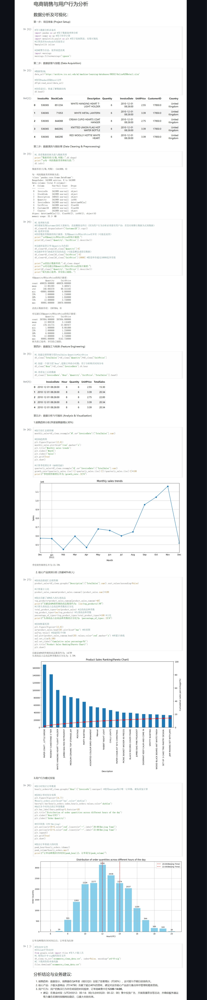

# 电商销售与用户行为分析项目 | E-Commerce Data Analysis

## 项目概述
本项目基于[Online Retail数据集](https://archive.ics.uci.edu/ml/datasets/Online+Retail)，通过对在线零售数据的深度挖掘与分析，构建了一套完整的分析流程：从使用**Python**进行数据获取与清洗，到利用**Tableau**创建交互式可视化仪表板。最终揭示了潜在的销售趋势、核心产品特征以及用户行为模式，为业务决策提供了数据驱动的支持。  

## 业务目标
1.  **趋势分析**: 分析销售额趋势与增长动力。
2.  **产品分析**: 识别核心创收产品类别（帕累托分析）。
3.  **用户行为**: 发现用户购买时间规律，优化运营策略。

## 技术栈
-   **语言**: Python(Pandas/Numpy/Matplotlib)
-   **工具**: Google Colab(Jupyter Notebook)、Tableau
-   **版本控制**: Git、GitHub
-   **技能**: 数据清洗、数据处理、可视化、业务解读

## 项目文件结构
```
E-Commerce-Analysis/
├── README.md                         # 项目说明（本文档）
├── E-Commerce_Analysis_Selene.ipynb  # 完整的Jupyter Notebook源码(代码+可视化图表+文字分析)
├── e-commerce_analysis_selene.py     # 完整的Python源码
├── Dashboard.jpeg                    # Dashboard截图
└── ecommerce_clean_data.csv          # 清洗后的数据（由脚本生成）
```

## 可视化展示
### 交互式仪表板截图


*如果您想体验交互式仪表板，可以访问此地址进入我的可视化仪表盘[点击此处进入Tableau Dashboard](https://prod-apnortheast-a.online.tableau.com/t/selenezhong-d25197ef07/views/E-Commerce-Data-Analysis/Dashboard)
### .ipynb源码及运行结果截图

## 快速开始
1.  **获取源代码方式**:
    -   选项一：推荐方式（使用Git）：如果您熟悉Git，请直接克隆本项目至本地：
    ```bash
    git clone https://github.com/SeleneZhong/Commerce-Data-Analysis.git
    ```
    -   选项二：简单方式（直接下载）
    -   **[下载Jupyter Notebook源码 (.ipynb文件)](./E_Commerce_Data_Analysis_Selene.ipynb)**
    -   **[下载Python 脚本源码(.py文件)](./e_commerce_data_analysis_selene.py)**
    
2.  **运行方式**:
    -   推荐在Google Colab中运行：上传 `E-Commerce-Data-Analysis.ipynb` 文件至[Google Colab](https://colab.research.google.com/) ，然后运行所有单元格即可逐步重现全部分析过程。
    -   本地运行：如果您本地已配置好Python环境（安装有pandas,numpy,matplotlib库），也可以直接运行.ipynb或.py文件。

## 核心发现与结论
### 1.销售趋势
-   通过月度销售额趋势图，发现第四季度销售额显著增长，经过计算得出Q4季度销售额相较于Q3增长**23.7%**，该增长趋势与年终节假日（如圣诞节）促销周期高度吻合，表明营销活动效果显著。
### 2.核心产品分析
-   使用帕累托法则分析，精准定位出仅 **3.79%** 的核心商品（147款）贡献了 **40%** 的总营收，揭示了极高的销售集中度。
### 3.用户行为分析
-   **订单时间分布**: 用户的购买行为存在明显的时间规律，订单高峰集中在UTC时间**12：00-14：00**（北京时间**晚上8点-10点**）。

## 业务建议
基于上述发现，提出以下可执行的战略建议：
### 1.营销策略
-   将广告预算和促销活动集中在Q4季度以及每日订单高峰时段（UTC 12:00-14:00），以最大化投资回报率(ROI)。
### 2.库存管理
-   对贡献40%营收的核心产品实施重点监控，优先保障其库存，以守住营收基本盘。
### 3.技术运维
-   建议在用户访问高峰时段增强服务器运维保障，确保网站稳定与用户体验。
